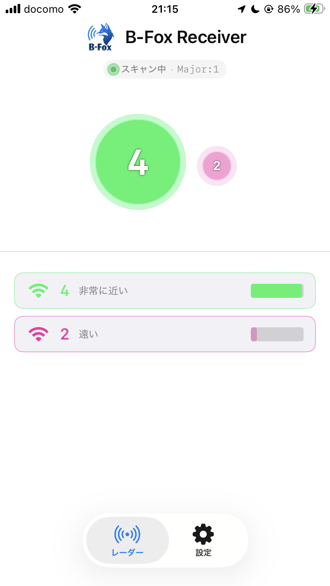

[English documentation is available here](./README.en.md)

# B-Fox

# B-Fox Beacon Control Panel
https://ayumu-bekki.github.io/B-Fox/bfox_beacon/web_client/

## 概要
B-Fox は、Bluetooth Low Energy (BLE) を利用し、Foxハンティングの遊びを再現・実現するためのオープンソースプロジェクトです。
導入・参加の障壁を下げ、「電波の強弱で隠し場所を探す」という無線方向探索のコアな楽しさを手軽に実現することを目指しています。

このプロジェクトを始めるにあたり、既存のFoxハンティング・ARDFに以下のような課題があり手軽でないと感じていました。
- 送信機・受信機のコストが高い
- 運用(ビーコン設置)に免許が必要
- アマチュア無線の帯域を利用するため、商用利用が不可 
- ARDFは競技のため厳格なルールがある

そこで、誰でも免許なしに利用できるBLEを利用して手軽に遊べる無線方向探索の遊びを実現します。

## 運用について
基本遊びだが発展としてARDF競技があるという位置付けを想定し、パークARDFを参考にルールを緩くする方向で運用資料(草案)を作成しました。
[B-Fox 運用・ルール案](./operation/OPERATION.md)

## 送信機・受信機について
[送受信機デバイスドキュメント](./docs/README.md) を参考にしてください。
このプロジェクトには、プログラム一式と、PCB・3Dプリンタで出力できるデータが含まれています。

プロトコルにiBeacon (BLE)を利用しているため、LightBlue (https://punchthrough.com/lightblue/) などをインストールすれば遊ぶことができます。

また、iOS向けに専用受信アプリを用意しています。

### 比較
 
|                    | ARDF                                          | B-Fox                |
| ------------------ | --------------------------------------------- | -------------------- |
| 受信機             | 専用もしくはAM受信機が必要                    | スマートフォンでも可 |
| 資格               | 受信機設置に第3級アマチュア無線技士以上が必要 | 不要                 |
| 無線局免許         | 必要                                          | 不要                 |
| 探知方法           | 音・Sメーター                                 | dBm値                |
| 競技性             | 競技として確立し世界大会がある                | 遊び                 |
| 受信アンテナの自作 | 可能                                          | 基本的に不可         |
| 利用する周波数     | 3.5MHz / 144MHz                               | 2.4GHz               |
| 空中線出力         | 3.5MHz(3-5W) / 144MHz(0.25-1.5W)程度          | 0.06-8mW             |
| 活動範囲           | 数キロメートル                                | 数百メートル         |

## リポジトリ内容説明
送信機・受信機のプログラムと機械設計・運用方法が含まれています。

- bfox_receiver
  - 受信機プログラム一式
- bfox_beacon
  - 送信機プログラム一式
- BFoxReceiverForIOS
  - iOS向け受信用アプリ
- docs
  - 技術資料・PCB・ケース(3Dプリンタ用)
- operation
  - 運用キット
